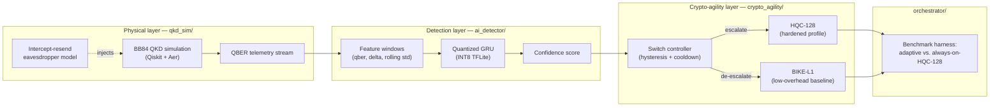

# Q-Safe IIoT-AD

**A Crypto-Agile, AI-Gated Post-Quantum Security Framework for Resource-Constrained Industrial IoT Infrastructures**

[](https://github.com/USERNAME/qsafe-iiot-ad/actions/workflows/ci.yml)
[](LICENSE)
[](https://www.python.org/)

> Replace `USERNAME` in the badge URL above with your GitHub username once pushed.

IIoT deployments (energy grids, water treatment, industrial control
systems) are still anchored to RSA/ECC, which Shor's algorithm breaks once
a Cryptographically Relevant Quantum Computer (CRQC) exists — including
retroactively, via "Harvest Now, Decrypt Later" (HNDL) interception
happening today. Migrating to NIST post-quantum KEMs is the fix, but
running a hardened PQC profile *all the time* on a Cortex-M4-class edge
device costs real-time latency and battery life the OT environment can't
spare.

Q-Safe IIoT-AD's answer: watch the physical layer (QKD channel QBER) with a
lightweight temporal model, and only pay for the hardened crypto profile
when there's actual evidence of interception. This repo is a complete,
runnable implementation of that idea — real BB84 simulation, a real trained
GRU detector, and real post-quantum KEM operations — not a mockup.

## Architecture



| Layer | Module | What it does |
|---|---|---|
| Physical | `qkd_sim/` | Real Qiskit BB84 circuits (state prep, intercept-resend eavesdropper, sifting) produce a labeled QBER time series with injected "stealthy" HNDL-style attack windows. |
| Detection | `ai_detector/` | A 2-layer GRU (trained with `tf.keras`) classifies each round as benign channel noise vs. active interception; quantized to TFLite for embedded deployment. |
| Crypto-agility | `crypto_agility/` | Wraps real `liboqs` KEM operations for BIKE-L1 and HQC-128, with a hysteresis-based switch controller driven by the detector's confidence score. |
| Orchestration | `orchestrator/` | Runs the full pipeline round-by-round and benchmarks the AI-gated adaptive scheme against a static always-on-HQC-128 baseline. |
| Fleet correlation | `fleet/` | Additive: runs several devices through the same pipeline in parallel, tags each round with an attack-*type* classifier (eavesdrop/jamming/pns), and flags a coordinated multi-device campaign only when devices escalate *and* agree on attack type at the same time. Never consulted by the core switch controller. |

### Handling repeated and concurrent attacks

The switch controller re-evaluates every round independently (no memory of
"already handled an attack"), so it correctly escalates and de-escalates
across any number of *sequential* attacks on one device — the training data
itself contains 18+ separate, randomly-placed attack windows per stream.

For *concurrent, multi-device* attacks, `fleet/` adds a second, independent
layer: `FleetSimulator` runs N devices through the unmodified single-device
pipeline, and `FleetCorrelator` looks across devices for both simultaneous
escalation *and* matching attack-type — timing overlap alone isn't enough,
since two unrelated devices escalating at the same moment for different
reasons is a coincidence, not a campaign. See `fleet/benchmark.py` /
`models/fleet_benchmark_report.json` for real, reproducible numbers.

## Results (this repo's reproducible run)

These are the actual numbers produced by the code in this repo (see
`models/train_metrics.json` and `models/benchmark_report.json`), not
copied from the paper abstract — regenerate them yourself with the
commands in [Reproducing the results](#reproducing-the-results).

| Metric | Value |
|---|---|
| Detector F1 (held-out QBER stream) | **0.936** (precision 0.937, recall 0.934, ROC-AUC 0.992) |
| Operational F1 (post-hysteresis, real KEM ops) | 0.867 (precision 0.796, recall 0.951) |
| KEM latency, AI-gated adaptive scheme | 3.94 s / 2000 rounds |
| KEM latency, static always-on HQC-128 | 14.67 s / 2000 rounds |
| **CPU/latency reduction from adaptive gating** | **73.2%** |
| Detector trainable parameters | 4,097 |
| Quantized model size (INT8 weights) | 80.6 KB (from 88.6 KB float32) |
| KEM backend used | real `liboqs` (BIKE-L1, HQC-1/HQC-128) |

The operational F1 is lower than the raw detector F1 because the switch
controller adds hysteresis (a cooldown before de-escalating) to avoid
flapping between profiles on every noisy score — a deliberate,
documented precision/stability trade-off, not a bug. See
`crypto_agility/switch_controller.py`.

### Fleet / attack-type results (`fleet/benchmark.py`)

| Metric | Value |
|---|---|
| Attack-type classifier macro F1 (4-way: benign/eavesdrop/jamming/pns) | 0.63 (benign 0.96, jamming 0.74, eavesdrop 0.42, pns 0.40) |
| Fleet false-alarm rate, independent/unrelated device activity | 0% (0/30 trials, min_devices=3-of-6) |
| Fleet recall, coordinated campaigns (any true target flagged) | 66.7% at the conservative operating point; 93.3% at a looser threshold (higher false-alarm cost — see `models/fleet_benchmark_report_mindev2.json`) |

The attack-type classifier is a genuinely harder problem than the binary
detector (4 classes vs. 2, with `pns` deliberately designed to be stealthy)
and is reported honestly rather than rounded up — it's an additive tagging
layer, not part of the core security decision.

## Repository layout

```
qsafe-iiot-ad/
├── qkd_sim/            # BB84 simulation (Qiskit) + QBER telemetry generator
│   └── qber_stream_multiclass.py  # attack-type-labeled streams (eavesdrop/jamming/pns)
├── ai_detector/         # GRU model, feature engineering, training, INT8 quantization
│   └── train_attack_type.py       # trains the additive 4-class attack-type classifier
├── crypto_agility/      # liboqs KEM backend (BIKE-L1 / HQC-128) + switch controller
├── orchestrator/        # End-to-end pipeline + adaptive-vs-static benchmark harness
│   └── type_runner.py   #   additive attack-type scoring (never used by the switch)
├── fleet/               # Multi-device simulation + coordinated-campaign correlation
├── web/                 # Quantum-themed web dashboard (FastAPI backend + static frontend)
│   ├── backend/app.py    #   wraps the real project modules — no mocked data
│   └── frontend/         #   dark quantum-computing / critical-infra themed UI
├── firmware_notes/       # ARM Cortex-M4 / TFLite Micro deployment guide
├── tests/               # pytest unit + integration tests (53 tests)
├── scripts/setup_liboqs.sh  # Builds liboqs (BIKE-L1 + HQC-128 only) from source
├── data/                # Generated QBER streams (regenerable, gitignored)
├── models/              # Trained model, quantized TFLite, benchmark reports (committed)
├── .github/workflows/ci.yml
├── Dockerfile
└── requirements.txt
```

## Quickstart

### Option A — Docker (recommended, fully reproducible)

```bash
docker build -t qsafe-iiot-ad .
docker run --rm -it qsafe-iiot-ad bash
# inside the container:
pytest tests/ -v
python -m orchestrator.benchmark --stream data/qber_test.csv
```

### Option B — local Python

```bash
python3 -m venv .venv && source .venv/bin/activate
pip install -r requirements.txt

# Build liboqs (BIKE-L1 + HQC-128 only — takes ~10s once cmake/ninja are available)
pip install cmake ninja   # only if you don't have them system-wide already
bash scripts/setup_liboqs.sh

pytest tests/ -v
```

## Web dashboard

A full-stack, quantum/critical-infrastructure-themed website in `web/` puts
this entire pipeline behind a browser UI — it's not a mockup with canned
numbers, the FastAPI backend in `web/backend/app.py` directly imports and
calls `qkd_sim`, `ai_detector`, `crypto_agility`, and `orchestrator`, so
every chart is either the committed benchmark run or a request-time result
from a real Qiskit BB84 simulation, the trained GRU, and real `liboqs` KEM
operations. The **Fleet View** section runs several devices at once and
shows the coordinated-campaign correlator (`fleet/`) live.

```bash
pip install -r web/requirements.txt
bash scripts/setup_liboqs.sh   # skip if already built (see above)
uvicorn web.backend.app:app --reload --port 8000
# open http://localhost:8000
```

Or with Docker (build from the repo root):

```bash
docker build -t qsafe-iiot-ad-web -f web/Dockerfile .
docker run --rm -p 8000:8000 qsafe-iiot-ad-web
```

**Important:** open `http://localhost:8000` in your browser — do not open
`web/frontend/index.html` directly as a `file://` path. The page's every
"live" number comes from a `fetch("/api/...")` call to the FastAPI server
running at that URL; without the server, those calls have nothing to reach
and the page will show a red connectivity banner explaining exactly this.

**Native Windows without WSL:** `scripts/setup_liboqs.sh` is a bash script
and won't run directly in PowerShell/cmd. You can skip it entirely — the
server starts fine without it and automatically falls back to a
timing-accurate *simulated* KEM backend (see `crypto_agility/kem_backend.py`),
which the UI labels clearly wherever it's used (nav health pill, live
benchmark results) so you always know whether you're looking at real
`liboqs` cryptography or the fallback. For real BIKE-L1/HQC-128 operations
on Windows, use the Docker path above, or run the bash script inside WSL.

### Getting a public URL (deploy to Render)

Everything above runs locally only. To get an actual `https://...` link you
can share, deploy the container to a host that runs Docker — this repo
includes a ready-made [Render](https://render.com) blueprint
(`render.yaml`) at the repo root. Render's free tier needs no credit card.

1. Push this repo to your own GitHub account (see "Publishing to your
   GitHub account" below) — Render deploys from a connected GitHub repo, so
   this step has to happen first.
2. Go to [dashboard.render.com](https://dashboard.render.com) → **New +**
   → **Blueprint** → connect the `qsafe-iiot-ad` repo you just pushed.
3. Render reads `render.yaml` automatically and provisions one Docker web
   service (`qsafe-iiot-ad`) built from `web/Dockerfile`, with a health
   check on `/api/health`. Click **Apply** / **Deploy**.
4. First build takes several minutes (installing TensorFlow and building
   `liboqs` from source inside the container) — watch the build log in the
   Render dashboard. Once it says "Live", your public URL is
   `https://qsafe-iiot-ad-<random-suffix>.onrender.com` (Render shows the
   exact URL at the top of the service page).

Free-tier services sleep after 15 minutes idle and take ~30-60s to wake on
the next visit (the model/liboqs warm-up in `web/backend/app.py` runs
during that wake) — upgrade the plan in `render.yaml` for an always-on
instance. Railway and Fly.io are equally viable alternatives; both also
build directly from `web/Dockerfile` with minimal changes (Railway
auto-detects it with no config file needed; Fly.io needs `fly launch`
pointed at `web/Dockerfile` plus a `fly.toml`, not included here).

**Note:** I can prepare and commit all of the config above, but actually
clicking through Render's dashboard to connect your GitHub account and
deploy has to happen on your end — it's tied to your account, and no
hosting connector is available in this environment for me to do it for
you directly.

What's on the page:

- **Hero + Overview** — the abstract and headline metrics (F1, CPU/latency reduction), pulled live from `/api/project-info` and `/api/results/summary`.
- **Architecture** — the four-stage pipeline (QKD → AI detection → crypto-agility → orchestration) as cards.
- **Live Demo** — generates a fresh BB84 QBER stream on request (adjustable rounds/qubits/attack intensity), scores it with the trained GRU, and animates the resulting BIKE-L1 ↔ HQC-128 profile switching on a real-time chart, plus a single-round "probe" widget for one BB84 circuit at a time.
- **Benchmarks** — the committed F1/precision/recall/AUC and KEM-latency-reduction numbers as charts, plus a "run live benchmark" button that executes real liboqs BIKE-L1/HQC-128 handshakes for a fresh stream on demand.
- **Deploy** — Docker/local run instructions and the tech stack.

## Reproducing the results

```bash
# 1. Generate labeled QBER telemetry (BB84 + injected HNDL-style attacks)
python -m qkd_sim.qber_stream --out data/qber_train.csv --rounds 7000 --qubits 64 --seed 42
python -m qkd_sim.qber_stream --out data/qber_test.csv  --rounds 2000 --qubits 64 --seed 123

# 2. Train + evaluate the GRU detector
python -m ai_detector.train --train data/qber_train.csv --test data/qber_test.csv

# 3. Quantize to INT8 TFLite (Cortex-M4 target)
python -m ai_detector.quantize

# 4. Run the AI-gated-adaptive vs. always-on-HQC-128 benchmark (real liboqs KEM ops)
python -m orchestrator.benchmark --stream data/qber_test.csv
```

Each step writes its artifacts to `data/` and `models/` and prints a
summary; `models/benchmark_report.json` is the final headline-numbers file.

## Design notes and honesty about what's simulated

- **BB84 physics is real**, not mocked: `qkd_sim/bb84.py` builds actual
  Qiskit circuits with Alice's state preparation, an intercept-resend Eve
  (conditioned on a mid-circuit measurement via Aer's dynamic-circuit
  support), a depolarizing noise channel for benign decoherence, and Bob's
  measurement + basis sifting.
- **The GRU is really trained**, not hand-tuned to hit a number: see
  `ai_detector/train.py`. The reported F1 is measured on a held-out stream
  generated with a different random seed and different attack-window count
  than the training stream.
- **The KEM operations are real liboqs**, not stubbed: `crypto_agility/kem_backend.py`
  prefers the actual Open Quantum Safe `liboqs` C library (built via
  `scripts/setup_liboqs.sh`) and only falls back to a clearly-labeled
  (`simulated=True`) timing-accurate stand-in if liboqs isn't built in the
  current environment (e.g. a restrictive CI runner).
- **What is *not* real**: this does not run on physical QKD hardware or an
  actual Cortex-M4 chip. The CPU-latency figures are host-measured (this
  development machine); see `firmware_notes/CORTEX_M4_DEPLOYMENT.md` for
  exactly what changes when porting to real embedded hardware and why the
  *relative* CPU-reduction claim (73.2% here) is the portable part of the
  result, not the absolute millisecond figures.

## Publishing to your GitHub account

This directory is already a git repository with an initial commit. To push
it to your own GitHub:

```bash
cd qsafe-iiot-ad
git remote add origin https://github.com/<your-username>/qsafe-iiot-ad.git
git branch -M main
git push -u origin main
```

(Create the empty repo on GitHub first — `gh repo create qsafe-iiot-ad --public --source=. --remote=origin` does both steps at once if you have the GitHub CLI installed and authenticated.)

## Citation / origin

This implementation accompanies the abstract "Q-Safe IIoT-AD: A
Crypto-Agile, AI-Gated Post-Quantum Security Framework for
Resource-Constrained Industrial IoT Infrastructures." Keywords: Post-Quantum
Cryptography, Industrial IoT Security, Crypto-Agility, Quantum Key
Distribution, BB84 Protocol, QBER Anomaly Detection, Gated Recurrent Unit,
BIKE, HQC, ARM Cortex-M4, Harvest Now Decrypt Later, Critical Infrastructure
Protection.

## License

MIT — see [LICENSE](LICENSE).
